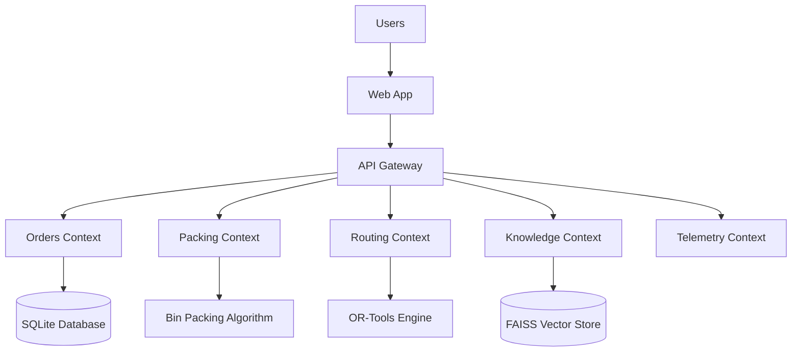
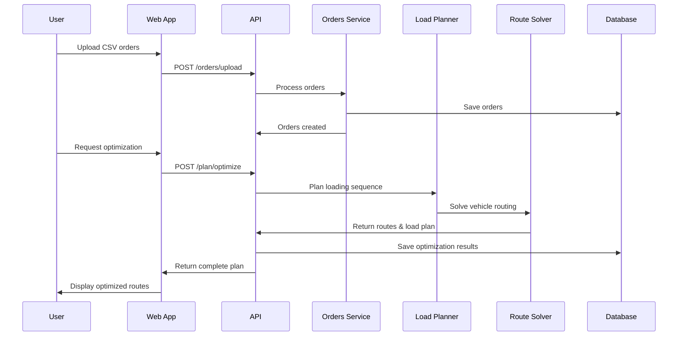

# ChainSync Architecture

## Overview

ChainSync is built using hexagonal architecture (ports & adapters) with clear separation of concerns across bounded contexts. The system is designed to be local-first with optional cloud integrations.

## System Context

## Container Diagram

```mermaid
graph TB
    subgraph "Frontend"
        W[Next.js Web App<br/>Port 3000]
    end
    
    subgraph "Backend"
        A[FastAPI<br/>Port 8000]
    end
    
    subgraph "Data Layer"
        DB[(SQLite<br/>Database)]
        VS[(FAISS<br/>Vector Store)]
    end
    
    subgraph "AI/Optimization"
        ST[Sentence Transformers]
        OR[OR-Tools VRP Solver]
        BP[Bin Packing Algorithm]
    end
    
    W --> A
    A --> DB
    A --> VS
    A --> ST
    A --> OR
    A --> BP
```

## Sequence Diagram: Order Processing Flow

## Bounded Contexts

### Orders Context
- **Responsibility**: Order lifecycle management
- **Entities**: Order, Customer, Address, TimeWindow
- **Services**: OrderService, ValidationService

### Packing Context
- **Responsibility**: Load planning and bin packing
- **Entities**: LoadPlan, LoadStep, Compartment, Zone
- **Services**: LoadPlanner, BinPackingService

### Routing Context
- **Responsibility**: Vehicle routing optimization
- **Entities**: Route, Stop, Vehicle, CostModel
- **Services**: RouteSolver, DistanceCalculator

### Knowledge Context
- **Responsibility**: RAG and document management
- **Entities**: Document, Chunk, Embedding
- **Services**: RAGService, VectorStore, EmbeddingService

### Telemetry Context
- **Responsibility**: Events and analytics
- **Entities**: Event, Metric, KPI
- **Services**: EventBus, MetricsCollector

## Ports & Adapters

### Ports (Interfaces)
- `OrderRepository`
- `RouteRepository` 
- `RouteSolver`
- `LoadPlanner`
- `VectorStore`
- `EventBus`

### Adapters (Implementations)

#### Local Adapters (Default)
- `SQLiteOrderRepository`
- `FAISSVectorStore`
- `ORToolsRouteSolver`
- `LocalEventBus`

#### Cloud Adapters (Optional)
- `S3VectorStore` (commented)
- `SQSEventBus` (commented)
- `CloudWatchMetrics` (commented)

## Technology Decisions

### Architecture Decision Records (ADRs)

1. **ADR-001: Local-First Architecture**
   - Decision: Use SQLite + FAISS for local operations
   - Rationale: Offline capability, no cloud dependencies
   - Status: Accepted

2. **ADR-002: Hexagonal Architecture**
   - Decision: Implement ports & adapters pattern
   - Rationale: Testability, flexibility, clean separation
   - Status: Accepted

3. **ADR-003: OR-Tools for VRP**
   - Decision: Use Google OR-Tools for route optimization
   - Rationale: Industry-standard, deterministic, well-documented
   - Status: Accepted

4. **ADR-004: FAISS for Vector Search**
   - Decision: Use Facebook FAISS for local vector operations
   - Rationale: Fast, local, no network dependencies
   - Status: Accepted

## Data Flow

1. **Order Ingestion**: CSV → Validation → Domain Models → SQLite
2. **Route Planning**: Orders → OR-Tools VRP → Optimized Routes
3. **Load Planning**: Orders + Routes → Bin Packing → Loading Sequence
4. **Knowledge Retrieval**: Query → FAISS Search → RAG Response
5. **Analytics**: Events → Metrics Collection → KPI Dashboard

## Deployment

### Local Development
- All services run on localhost
- SQLite file-based database
- FAISS index files
- No external dependencies

### Production (Docker)
- Containerized services
- Shared data volumes
- Health checks and monitoring
- Optional cloud adapters (disabled by default)

## Security

- No authentication required for local mode
- Optional JWT for production deployment
- Input validation with Pydantic/Zod
- CORS configured for development
- File upload restrictions

## Observability

- Structured logging with loguru
- Optional OpenTelemetry tracing
- Health check endpoints
- Metrics collection for KPIs
- Error boundaries in React components